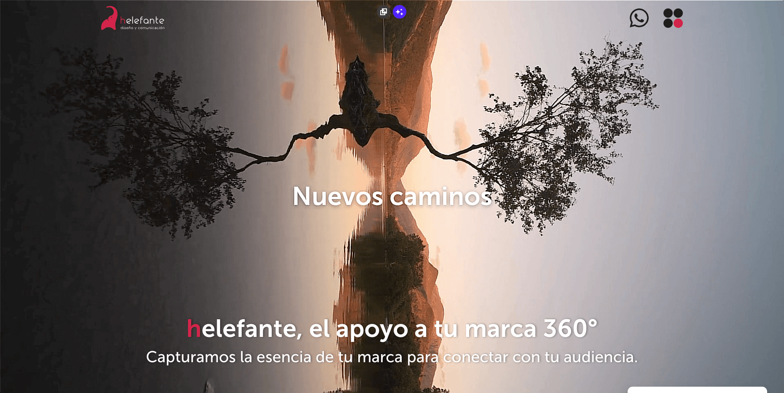
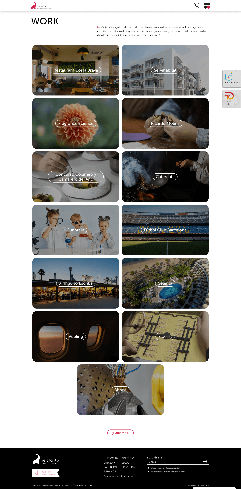

# 🌐 Portfolio Web – Carlos Turmo

Aquí encontrarás una selección de proyectos web en los que he trabajado, principalmente durante mi etapa en **Helefante Diseño y Comunicación (2012–2025)**.  
Todos ellos desarrollados en **WordPress con temas personalizados**, plugins a medida y, en algunos casos, integraciones avanzadas con APIs externas.  

---

## 🚀 Proyectos destacados

### Helefante diseño y comunicación
- **Descripción:** Web corporativa de la agencia. Integración de elementos 3D con **Three.js**.  
- **Tecnologías:** WordPress, Three.js, SCSS, PHP.  
- **URL:** [helefante.com](https://helefante.com)  

---

<!-- ### Restaurants Escribà
- **Descripción:** Web corporativa con reservas online, diseño personalizado.  
- **Tecnologías:** WordPress, PHP, SCSS.  
- **URL:** [restaurantsescriba.com](https://restaurantsescriba.com)  

---

### Solventa IT
- **Descripción:** Web corporativa de soluciones IT.  
- **Tecnologías:** WordPress, SCSS, PHP.  
- **URL:** [solventait.com](https://solventait.com)  

---

### Dental Comunicación
- **Descripción:** Portal de servicios de comunicación para clínicas dentales.  
- **Tecnologías:** WordPress, PHP, SCSS.  
- **URL:** [dentalcomunicacion.com](https://dentalcomunicacion.com)  

---

### Ffuuss – Customizador de productos
- **Descripción:** Herramienta para personalización de secadores de manos.  
- **Tecnologías:** WordPress, JavaScript.  
- **URL:** [ffuuss.com](https://ffuuss.com)  
- **Repo asociado:** [doityourself-handdryer-customizer](https://github.com/zeliuk/doityourself-handdryer-customizer)  

--- -->

## 📌 Nota
Algunos proyectos han cambiado de diseño o ya no están online. He incluido **capturas de pantalla originales** como referencia.
