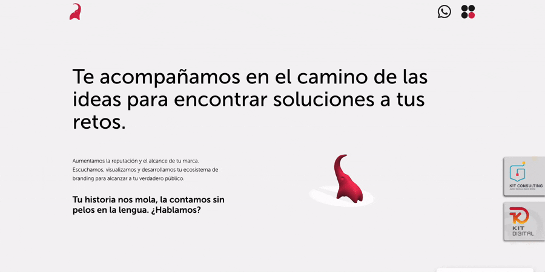
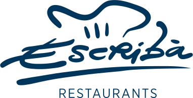
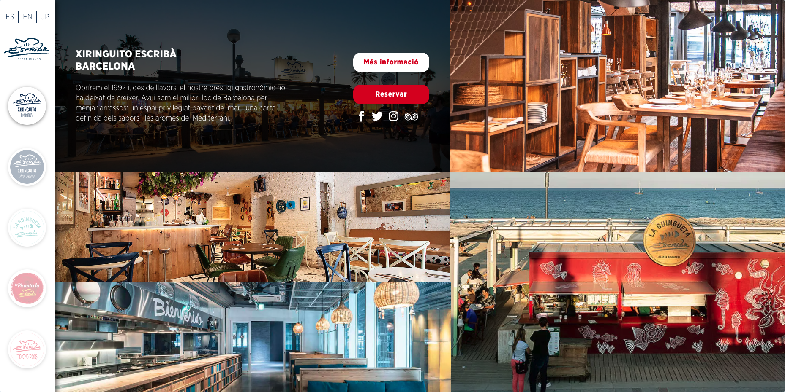

# 🌐 Portfolio Web – Carlos Turmo

Aquí encontrarás una selección de proyectos web en los que he trabajado, principalmente durante mi etapa en **Helefante Diseño y Comunicación (2012–2025)**.  
Todos ellos desarrollados en **WordPress con temas personalizados**, plugins a medida y, en algunos casos, integraciones avanzadas con APIs externas.  

---

## 📑 Índice
- [Helefante diseño y comunicación](#helefante-diseño-y-comunicación)
- [Caternews Digital](#caternews-digital)
- [Restaurants Escribà](#restaurants-escribà)
- [Fragrance Science](#fragrance-science)
- [Ricardo Molina / Ingrentia](#ricardo-molina--ingrentia)
- [Signo Delta](#signo-delta)
- [Aymerich Comunicació](#aymerich-comunicació)
- [AIA – Siopeia](#aia--siopeia)
- [OTS Group](#ots-group)
- [Ffuuss – Customizador de productos](#ffuuss--customizador-de-productos)
- [Common Thinking](#common-thinking)
<!-- - [Restaurants Escribà](#restaurants-escribà) -->
<!-- - [Solventa IT](#solventa-it) -->
<!-- - [Dental Comunicación](#dental-comunicación) -->
<!-- - [Ffuuss – Customizador de productos](#ffuuss--customizador-de-productos) -->

---

## Proyectos destacados

- **Descripción:** Web corporativa de la agencia. Integración de elementos 3D con **Three.js**.
- **Tecnologías:** WordPress, Three.js, SCSS, PHP.
- **URL:** [helefante.com](https://helefante.com)  

---

### Caternews Digital

- **Descripción:** Portal de noticias relacionadas con el sector HORECA.  
- **Tecnologías:** WordPress, tema personalizado.  
- **Diseño:** Proporcionado por Helefante.  
- **URL:** [caternewsdigital.com](https://caternewsdigital.com)

---

### Restaurants Escribà

- **Descripción:** Web corporativa con reservas online, diseño personalizado. Cartas digitales.
- **Tecnologías:** WordPress, PHP, SCSS.  
- **Diseño:** Proporcionado por Helefante.  
- **URL:** [restaurantsescriba.com](https://restaurantsescriba.com)  

---

### Fragrance Science
- **Descripción:** Web corporativa.  
- **Tecnologías:** WordPress, tema personalizado.  
- **Diseño:** Proporcionado por Helefante.  
- **URL:** [fragrancescience.com](https://fragrancescience.com/es)  

---

### Ricardo Molina / Ingrentia
- **Descripción:** Webs corporativas.  
- **Tecnologías:** WordPress, tema personalizado.  
- **Diseño:** Proporcionado por el cliente.  
- **URLs:** [ricardomolina.com](https://ricardomolina.com) / [ingrentia.com](https://ingrentia.com)  

---

### Signo Delta
- **Descripción:** Web corporativa.  
- **Tecnologías:** WordPress, tema personalizado.  
- **Diseño:** Proporcionado por el cliente.  
- **URL:** [signodelta.com](https://signodelta.com)  

---

### Aymerich Comunicació
- **Descripción:** Web corporativa de comunicación.  
- **Tecnologías:** WordPress, tema personalizado.  
- **Diseño:** Proporcionado por el cliente.  
- **URL:** [aymerich-comunicacio.com](https://aymerich-comunicacio.com)  

---

### AIA – Siopeia
- **Descripción:** Web corporativa.  
- **Tecnologías:** WordPress, tema personalizado.  
- **Diseño:** Proporcionado por el cliente.  
- **URL:** [aia.es/siopeia](https://aia.es/siopeia)  

---

### OTS Group
- **Descripción:** Web corporativa.  
- **Tecnologías:** WordPress, tema personalizado.  
- **Diseño:** Proporcionado por el cliente.  
- **URL:** [otsgroup.es](https://otsgroup.es)  

---

### Ffuuss – Customizador de productos
- **Descripción:** Web corporativa.
- **Tecnologías:** WordPress, tema personalizado y customizador de productos.  
- **Diseño:** Proporcionado por el cliente (el diseño actual es diferente).  
- **URL:** [ffuuss.com](https://ffuuss.com)  
- **Repo asociado:** [doityourself-handdryer-customizer](https://github.com/zeliuk/doityourself-handdryer-customizer)  

---

### Common Thinking
- **Descripción:** Prototipo web (sin finalizar). El proyecto no siguió adelante.  
- **Tecnologías:** WordPress.  
- **URL:** [commonthinking.net](https://commonthinking.net)  

## 📌 Nota
Algunos proyectos han cambiado de diseño o ya no están online. He incluido **capturas de pantalla originales** como referencia.
